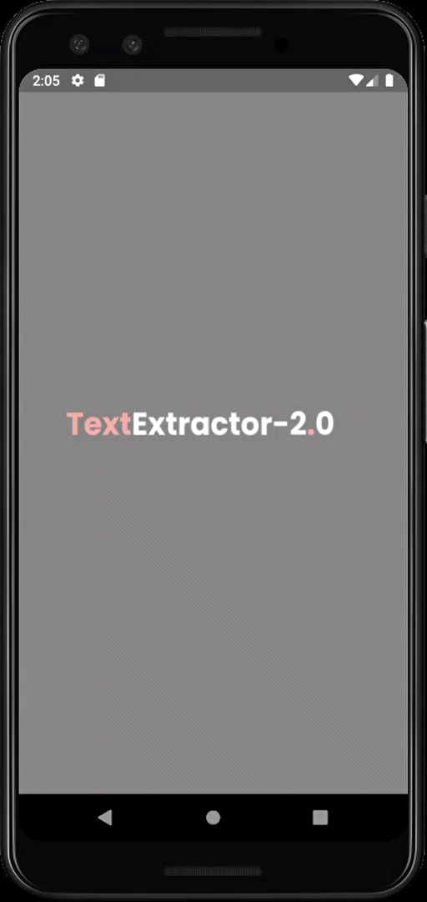

  

:bird: Flutter App to extract text from images (OCR tool).

# Downloads:
<!--
-->

Please do check the [releases](https://github.com/Aman-zishan/textextractor/releases) for the source code along with APK version.

## Features:

* Performs OCR (Other Character Recognition) on uploaded images
* Improved OCR
* Save extracted text in a file

## API used:
                                       
This application is built using the [api](http://textextractor2.herokuapp.com/api/v1) developed from the main application: [TextExtractor2.0](http://textextractor2.herokuapp.com/)

## Contributors: :heart:

- [Abhinav](https://github.com/AbhinavRajesh) - API
- [Prakhar](https://github.com/Prakhar314) - Basic UI and functionality
- [Alina](https://github.com/AlinaStepanova) - Bug fixes

## Contribution

Go through the [guidelines](https://github.com/Aman-zishan/textextractor/blob/master/CONTRIBUTING.md) and feel free to contribute to this open source project!

